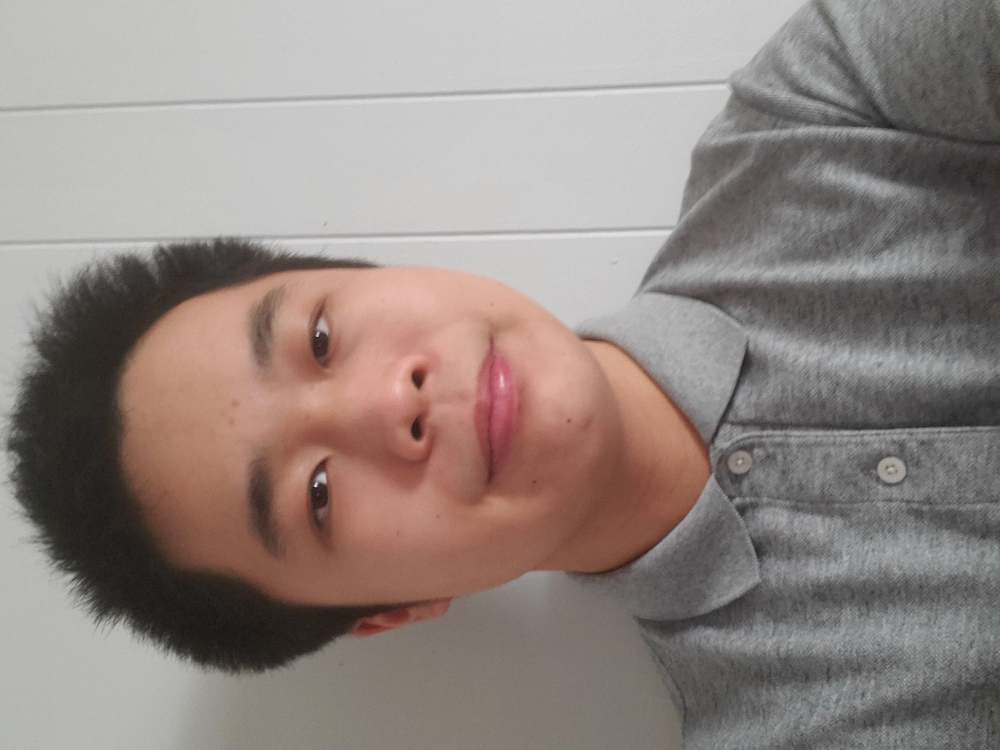

# My Page
## David Liu

## Background
* Thrid year __Math-CS__ student
* Born in _China_
* Some experience with web dev: **_HTML, JS, CSS_**
* Enjoys video games, ~~basketball, pickelball~~
* Working towards becoming an <sub>indie game dev</sub>
## Projects
1. Worked on the prototype of a group assigner, designed to assign a list of students to various groups for in-class exercises.
    > It was refined by my friend
2. Followed a basic tutorial covering a portfolio.
   * Concepts include: ```HTML, JS, CSS```
3. Vampire Survivors Clone
   * [x] Using pygames
   * [x] Unfinished
   * [Repository](https://github.com/shootingdarts/VampireSurvivorClone)
  
## [Back to Top](#david-liu)
